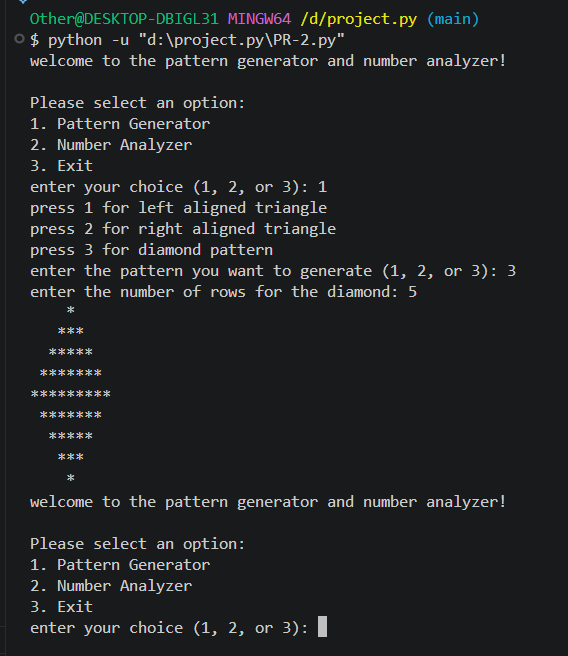
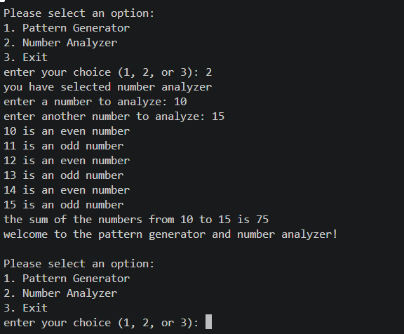

import base64

readme_content = """# Pattern Generator and Number Analyzer

A versatile, interactive command-line Python application that provides tools for generating geometric text patterns and performing statistical/property analysis on ranges of numbers. 

The application utilizes a user-friendly menu system driven by Python's native `match-case` structural pattern matching, allowing users to seamlessly switch between different operational modes or exit at will.

## Features

### 1. Pattern Generator
Generates precise text-based geometric shapes using asterisks (`*`) based on user-defined dimensions:
* **Left-Aligned Triangle**: Generates an incremental triangle with alignment to the left margin.
* **Right-Aligned Triangle**: Generates an incremental triangle padded with dynamic spacing to align perfectly to the right.
* **Diamond Pattern**: Creates a symmetrical top and bottom diamond shape based on a specified peak row count.

### 2. Number Analyzer
Performs iterative evaluation over a closed interval sequence defined by two user-specified integers:
* **Parity Verification**: Evaluates each integer within the range sequentially to classify and display it as either **Even** or **Odd**.
* **Cumulative Summation**: Calculates and prints the total aggregate sum of all integers falling within the defined bounding range (inclusive).

### 3. Continuous Execution & Input Validation
* Wrapped in an infinite operational loop (`while True`) to ensure users can execute multiple tasks consecutively without restarting the script.
* Implements fallback wildcard matching (`case _`) to intercept invalid menu inputs gracefully and notify the user.

---

## Output:-

---

---

## Architectural Workflow

Below is the structured logical flow of the application's runtime sequence: