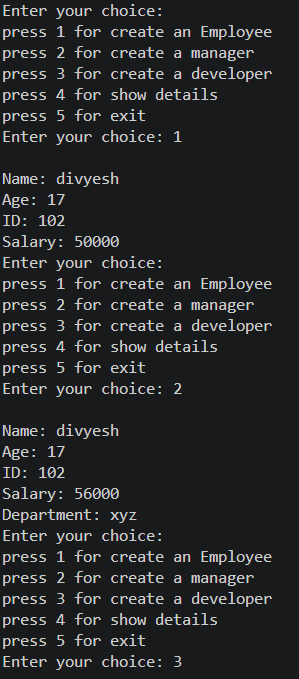
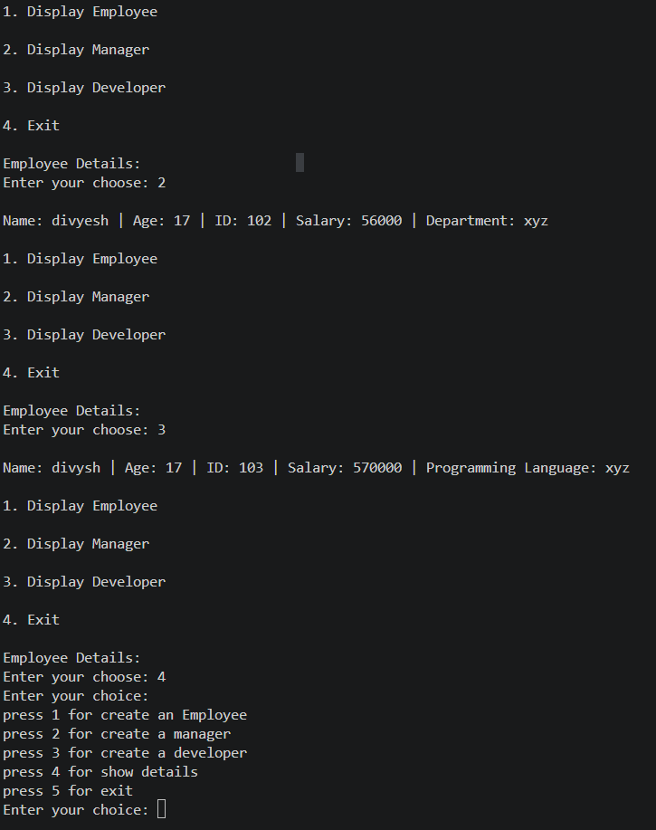
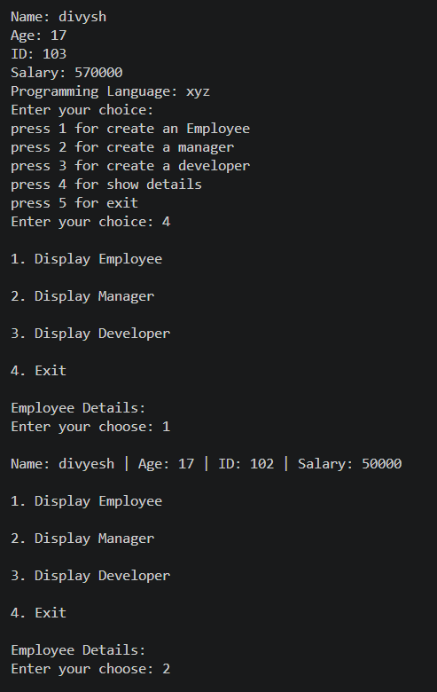

<div align="center">

# 👨‍💼 Employee Management System
### *Object-Oriented Employee, Manager & Developer Record Management in Python*


> *"Good software starts with good organization — just like good companies start with good employees."*

</div>

---

# 📋 Table of Contents

- [📌 Overview](#-overview)
- [🎯 Problem Statement](#-problem-statement)
- [✨ Key Features](#-key-features)
- [🏗️ Project Structure](#-project-structure)
- [🔄 Workflow](#-workflow)
- [👤 Employee Class](#-employee-class)
- [👨‍💼 Manager Class](#-manager-class)
- [👨‍💻 Developer Class](#-developer-class)
- [📋 Menu Operations](#-menu-operations)
- [🧠 OOP Concepts Used](#-oop-concepts-used)
- [🛠️ Tech Stack](#️-tech-stack)
- [🏆 Advantages](#-advantages)

---

# 📌 Overview

The **Employee Management System** is a menu-driven Python application built using **Object-Oriented Programming (OOP)** concepts such as:

- Classes & Objects
- Inheritance
- Encapsulation
- Method Overriding
- Lists for Data Storage

The system allows users to create and manage Employees, Managers, and Developers through an interactive console interface.

---

# 🎯 Problem Statement

Develop a Python application that stores and manages employee information using inheritance.

The system should:

- Create Employee records
- Create Manager records
- Create Developer records
- Store data in separate lists
- Display stored information
- Provide an interactive menu interface

---

# ✨ Key Features

| Feature | Description |
|----------|------------|
| 👤 Employee Creation | Add normal employees |
| 👨‍💼 Manager Creation | Add managers with department |
| 👨‍💻 Developer Creation | Add developers with programming language |
| 🔒 Encapsulation | Uses private variables (__id and __salary) |
| 🧬 Inheritance | Manager and Developer inherit Employee |
| 📋 Menu Driven | Interactive CLI menu |
| 📦 Data Storage | Uses Python lists |
| 🖥️ Console Based | Easy to run in terminal |

---

# 🏗️ Project Structure

```

📦 Employee-Management-System
│
├── PR_4.py
│
└── README.md

```

---

# 🔄 Workflow

```

Start Program
      │
      ▼
 Display Menu
      │
 ┌────┼────┐
 ▼    ▼    ▼
Emp Manager Developer
 │     │      │
 ▼     ▼      ▼
Store Data in Lists
      │
      ▼
 Display Records
      │
      ▼
     Exit

```

---

# 👤 Employee Class

### Attributes

```python
name
age
__id
__salary
```

### Methods

```python
setter()
display()
```

The Employee class is the base class used to store employee details.

---

# 👨‍💼 Manager Class

The Manager class inherits from Employee.

### Additional Attribute

```python
department
```

### Methods

```python
setter()
display()
```

Manager records include department information.

---

# 👨‍💻 Developer Class

The Developer class inherits from Employee.

### Additional Attribute

```python
language
```

### Methods

```python
setter()
display()
```

Developer records include programming language information.

---

# 📋 Menu Operations

### Main Menu

```text
1. Create Employee
2. Create Manager
3. Create Developer
4. Show Details
5. Exit
```

### Display Menu

```text
1. Display Employee
2. Display Manager
3. Display Developer
4. Exit
```

---

# 🧠 OOP Concepts Used

## Inheritance

```python
class manager(Employee):
class Developer(Employee):
```

Manager and Developer inherit properties from Employee.

## Encapsulation

```python
self.__id
self.__salary
```

Private variables protect sensitive data.

## Method Overriding

```python
def display():
```

Child classes override display() to show additional information.

---

# 🛠️ Tech Stack

| Tool | Purpose |
|--------|---------|
| Python | Programming Language |
| OOP | Application Design |
| Inheritance | Code Reusability |
| Lists | Data Storage |
| CLI | User Interaction |

---

# 📈 Output Example



---



---



---

# 🏆 Advantages

- Easy to understand
- Beginner-friendly OOP project
- Demonstrates inheritance
- Demonstrates encapsulation
- Menu-driven interface
- Extendable for future features
- No external libraries required

---

# 🚀 Future Improvements

- File handling support
- Database integration
- Search employee by ID
- Delete employee records
- Update employee details
- GUI version using Tkinter

---

# 👤 Author
<div align="center">

**Divyesh Jadav**

Employee Management System using Object-Oriented Programming in Python.
</div>

---

# 📄 License

This project is created for educational purposes.

MIT License

---

<div align="center">

⭐ If you found this project useful, consider giving it a star! ⭐

</div>

---
<div align="center">
Thank You 🤗
<div>

---
