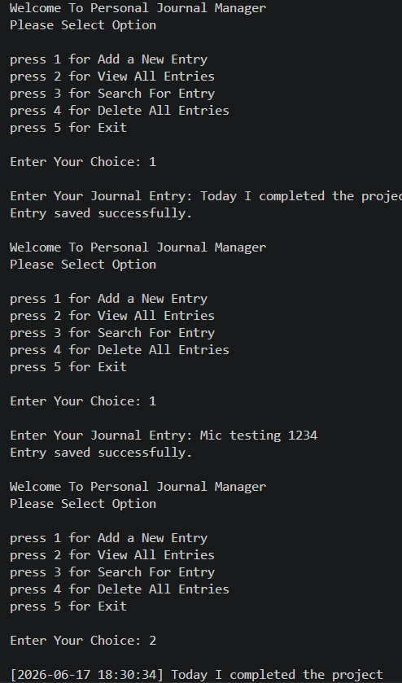
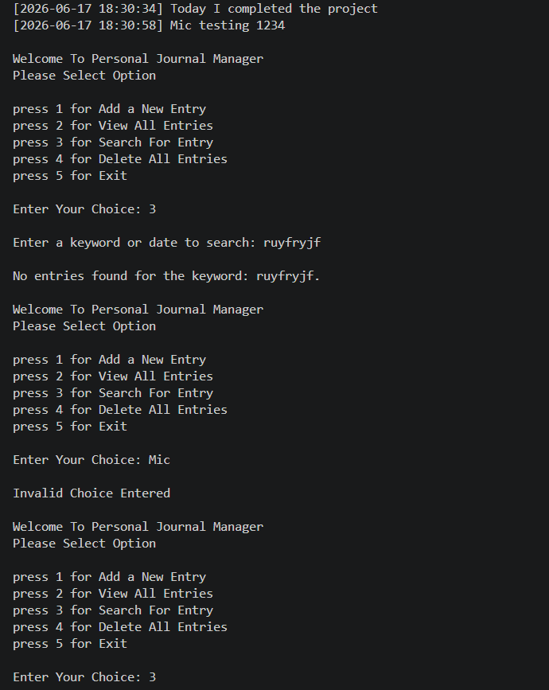
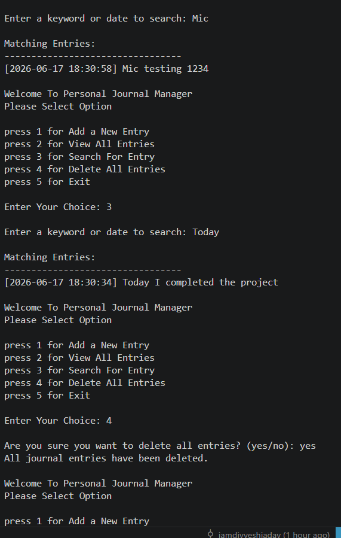
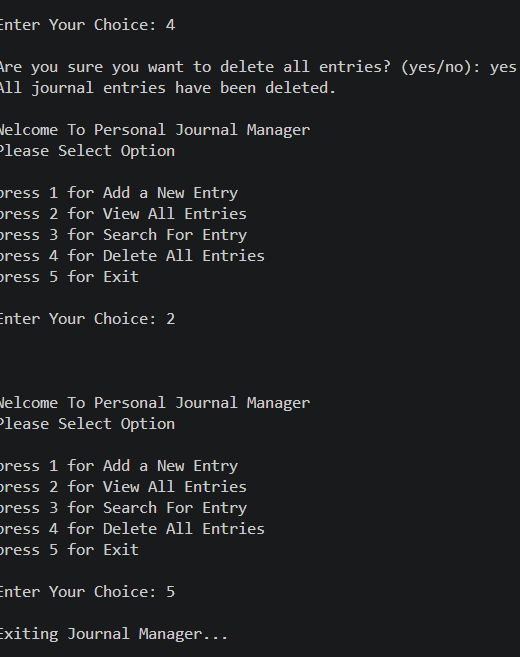

<div align="center">

# -- ! Personal Journal Manager ! --
### *Interactive Console-Based Journal Entry System*

[](https://www.python.org/)
[](https://www.python.org/)
[](https://www.python.org/)
[](https://www.python.org/)

<br/>

> *"A journal is a mirror for your mind — write daily, reflect deeply."*

</div>

---

## 📋 Table of Contents

- [📌 Overview](#-overview)
- [🎯 Problem Statement](#-problem-statement)
- [✨ Key Features](#-key-features)
- [🏗️ Project Structure](#️-project-structure)
- [🔄 Project Workflow](#-project-workflow)
- [📝 Feature Breakdown](#-feature-breakdown)
- [🛠️ Tech Stack](#️-tech-stack)
- [📈 Results & Insights](#-results--insights)
- [🏆 Advantages](#-advantages)
- [📄 License](#-license)
- [👤 Author](#-author)
- [🙏 Acknowledgements](#-acknowledgements)

---

## 📌 Overview

The **Personal Journal Manager** is a beginner-friendly, interactive Python console application that demonstrates core programming concepts such as **Object-Oriented Programming (OOP)**, **file handling**, **string manipulation**, **user input validation**, and **menu-driven design**. The program presents a persistent menu loop that runs continuously until the user chooses to exit.

This project is designed to:
- Strengthen understanding of Python classes and instance methods
- Practice file I/O operations (read, write, append)
- Apply string search logic for keyword-based entry filtering
- Build a practical CLI tool that stores data persistently across sessions

---

## 🎯 Problem Statement

> **Objective:** Build a console-based interactive journal manager to add, view, search, and delete personal journal entries with timestamps.

You are building a personal productivity utility for individuals who want to maintain a simple text-based diary. The program must accept user choices from a menu and execute the corresponding task — writing a new entry, displaying all saved entries, searching by keyword or date, or clearing all data.

| 📂 Feature | 📄 Type | 🔍 Description |
|------------|---------|----------------|
| Add Entry | File Write | Saves a timestamped journal entry to a text file |
| View All Entries | File Read | Reads and displays all stored journal entries |
| Search Entry | String Match | Filters entries by keyword or date string |
| Delete All Entries | File Overwrite | Clears all saved entries after confirmation |
| Exit | Loop Control | Exits the program gracefully |

The goal is to demonstrate **practical Python programming skills** through a clean, class-based, menu-driven program with persistent file storage.

---

## ✨ Key Features

| Feature | Description |
|--------|-------------|
| 🔁 **Infinite Menu Loop** | Program runs continuously via `while True` until user selects Exit |
| 📝 **Add Entries** | Saves user input with auto-generated timestamp to `journal.txt` |
| 📖 **View All Entries** | Reads and displays every stored entry from the file |
| 🔍 **Keyword Search** | Case-insensitive search across all entries by keyword or date |
| 🗑️ **Delete All** | Clears all journal entries after explicit user confirmation |
| 🕐 **Auto Timestamp** | Uses `datetime.now()` to tag every entry with date and time |
| ⚠️ **Error Handling** | Catches `FileNotFoundError` when no entries exist yet |
| 🏛️ **OOP Design** | All features encapsulated in the `JournalManager` class |
| 🔒 **Confirm Before Delete** | Requires `yes` input before permanently clearing entries |
| 🧩 **Match-Case Dispatch** | Uses Python 3.10+ `match` statement for clean menu routing |

---

## 🏗️ Project Structure

```
📦 personal-journal-manager/
│
├── 📄 journal_manager.py    ← Main Python script (entry point)
├── 📄 journal.txt           ← Auto-created file to store journal entries
│
└── 📄 README.md             ← Project documentation
```

> **Note:** `journal.txt` is created automatically the first time you add an entry. You do not need to create it manually.

---

## 🔄 Project Workflow

```
Program Start
      │
      ▼
┌─────────────────────────────────┐
│        Display Main Menu        │  ← Options: Add / View / Search / Delete / Exit
└──────────────┬──────────────────┘
               │
     ┌─────────┼──────────┬──────────┬──────────┐
     ▼         ▼          ▼          ▼          ▼
  Choice 1  Choice 2   Choice 3   Choice 4   Choice 5
  (Add)     (View All) (Search)   (Delete)    (Exit)
     │         │          │          │
     ▼         ▼          ▼          ▼
  Get Input  Read File  Keyword    Confirm?
  + Time     + Print    Match        │
     │         │          │        yes/no
     ▼         ▼          ▼          │
  Append to  Display   Print       Clear
  journal.txt  All    Matches      File
     │         │          │          │
     └─────────┴──────────┴──────────┘
                          │
                   Loop Back to Menu
                          │
                   (Choice 5) Exit ✅
```

---

## 📝 Feature Breakdown

### 1. Add a New Entry

> Records user input with an auto-generated timestamp and appends it to `journal.txt`.

**Logic:**
```python
def add_entry(self):
    current_time = datetime.now().strftime("%Y-%m-%d %H:%M:%S")
    msg = input("Enter Your Journal Entry: ")
    final_text = f"[{current_time}] {msg}\n"
    myfile = open(self.file_name, 'a')
    myfile.write(final_text)
    myfile.close()
    print("Entry saved successfully.")
```

**Sample Output:**
```
Enter Your Journal Entry: Had a productive morning working on Python.
Entry saved successfully.
```

**Stored in `journal.txt`:**
```
[2026-05-27 09:45:12] Had a productive morning working on Python.
```

---

### 2. View All Entries

> Opens the journal file and prints every saved entry to the console.

**Logic:**
```python
def show_all(self):
    try:
        myfile = open(self.file_name, 'r')
        print(myfile.read().strip())
        myfile.close()
    except FileNotFoundError:
        print("No journal entries found. Start by adding a new entry!")
```

**Sample Output:**
```
[2026-05-27 09:45:12] Had a productive morning working on Python.
[2026-05-27 11:30:05] Finished reading a chapter on OOP concepts.
[2026-05-27 14:00:44] Went for a walk and felt refreshed.
```

---

### 3. Search for an Entry

> Performs a case-insensitive search across all journal entries and displays only matching lines.

**Logic:**
```python
def search_word(self):
    s_word = input("Enter a keyword or date to search: ")
    is_found = False
    try:
        myfile = open(self.file_name, "r")
        for line in myfile:
            if s_word.lower() in line.lower():
                if is_found == False:
                    print("\nMatching Entries:")
                    print("---------------------------------")
                    is_found = True
                print(line.strip())
        myfile.close()
        if is_found == False:
            print("\nNo entries found for the keyword:", s_word + ".")
    except FileNotFoundError:
        print("\nNo journal entries found.")
```

**Key Concepts Used:**

| Concept | Detail |
|---------|--------|
| 🔡 `.lower()` | Case-insensitive matching for both keyword and entry |
| 🏳️ Boolean Flag | `is_found` tracks if any match was printed |
| 🔁 Line-by-line Read | Iterates file without loading all into memory |
| 📅 Date Search | Search by date string like `2026-05-27` to get all entries for a day |

**Sample Output (keyword: "python"):**
```
Enter a keyword or date to search: python

Matching Entries:
---------------------------------
[2026-05-27 09:45:12] Had a productive morning working on Python.
```

---

### 4. Delete All Entries

> Clears all journal entries permanently after requiring explicit confirmation.

**Logic:**
```python
def clear_all(self):
    ans = input("Are you sure you want to delete all entries? (yes/no): ")
    if ans.lower() == "yes":
        myfile = open(self.file_name, 'w')
        myfile.write("")
        myfile.close()
        print("All journal entries have been deleted.")
    else:
        print("Delete operation cancelled.")
```

**Sample Output:**
---

---


---


---


---

### 5. Menu & Match-Case Dispatch

> The main loop uses Python 3.10+ `match` statement for clean, readable option routing.

**Logic:**
```python
match c:
    case "1": object.add_entry()
    case "2": object.show_all()
    case "3": object.search_word()
    case "4": object.clear_all()
    case "5":
        print("Exiting Journal Manager...")
        break
    case _:
        print("Invalid Choice Entered 🚫")
```

---

## 🛠️ Tech Stack

| Tool | Version | Purpose |
|------|---------|---------|
| 🐍 **Python** | 3.10+ | Core programming language |
| 🏛️ **Class / OOP** | Built-in | Encapsulates all journal features |
| 📁 **File I/O** | Built-in | `open()` for read, write, and append |
| 🕐 **datetime** | Standard Library | Auto-generates timestamps for entries |
| 🔁 **while True** | Built-in | Persistent menu loop |
| 🧩 **match / case** | Python 3.10+ | Clean menu dispatch (structural pattern matching) |
| 🖨️ **print() / input()** | Built-in | Console I/O and user interaction |
| 🛡️ **try / except** | Built-in | Handles missing file gracefully |

---

## 📈 Results & Insights

After running the program, the following capabilities are demonstrated:

- ✅ **Persistent Storage** — Entries are saved to disk and remain across program restarts
- 🕐 **Auto Timestamping** — Every entry is tagged with the exact date and time
- 🔍 **Flexible Search** — Search works by any keyword OR by date (e.g., `2026-05-27`)
- 🔁 **Infinite Loop Menu** — Program stays active until the user explicitly exits
- ⚠️ **Safe Deletion** — Requires explicit `yes` confirmation before clearing all data
- 🛡️ **Error Resilience** — Gracefully handles missing file with a helpful message

---

## 🏆 Advantages

| Advantage | Detail |
|-----------|--------|
| 🎓 **Beginner Friendly** | Covers OOP, file I/O, error handling, and loops in one project |
| 🏛️ **OOP Design** | Clean class structure makes code easy to extend and maintain |
| 💾 **No Database Needed** | Uses plain `.txt` file — no setup, no dependencies |
| ⚡ **Lightweight** | Single-file script, runs instantly from any terminal |
| 🔍 **Smart Search** | Case-insensitive matching works for keywords and date strings |
| 🔒 **Safe by Default** | Confirmation gate prevents accidental deletion |
| 🧪 **Extensible** | Easy to add features like edit entry, export to PDF, or count entries |
| 📖 **Readable Code** | Clean `match` dispatch and method separation keep logic clear |

---

## 📄 License

This project is licensed under the **MIT License** — see the [LICENSE](LICENSE) file for full details.

```
MIT License — Free to use, modify, and distribute with attribution.
```

---

## 👤 Author

<div align="center">

### divyesh jadav

</div>

---

## 🙏 Acknowledgements

Special thanks to the following resources and communities that made this project possible:

- 📚 [Python Official Docs](https://docs.python.org/3/) — Official Python language reference
- 🏛️ [Real Python — OOP](https://realpython.com/python3-object-oriented-programming/) — In-depth OOP tutorials
- 📁 [Real Python — File I/O](https://realpython.com/read-write-files-python/) — File handling guide
- 🕐 [Python datetime Docs](https://docs.python.org/3/library/datetime.html) — Timestamp formatting reference
- 🧩 [PEP 634 — Match Statement](https://peps.python.org/pep-0634/) — Structural pattern matching
- 🖥️ [W3Schools Python](https://www.w3schools.com/python/) — Beginner Python reference
- 💬 [Stack Overflow Community](https://stackoverflow.com/) — Problem-solving support
- 📖 [Kaggle Learn](https://www.kaggle.com/learn) — Python and programming courses

---

<div align="center">

---

*Made with ❤️ and ☕ — Last updated: 27 May, 2026*

</div>
