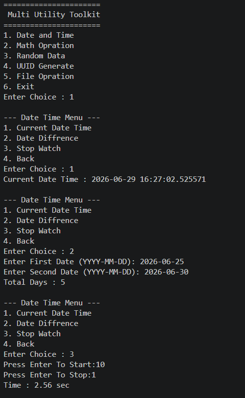
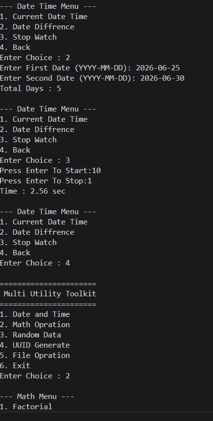
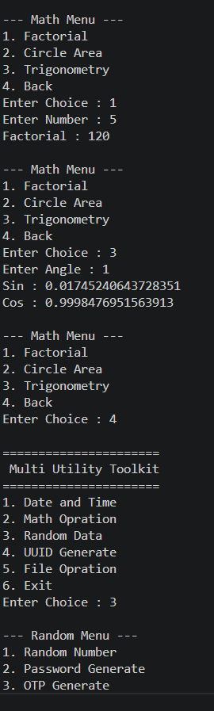
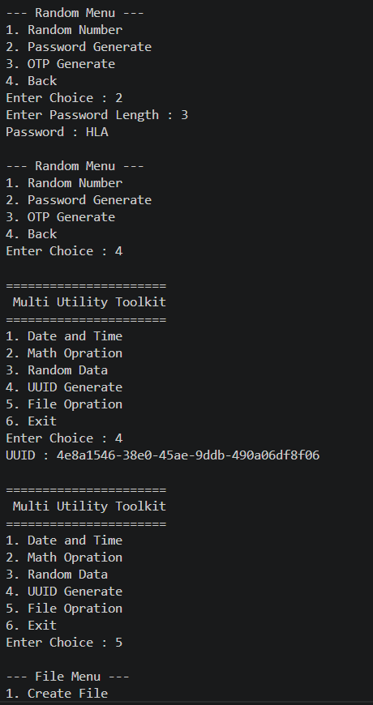
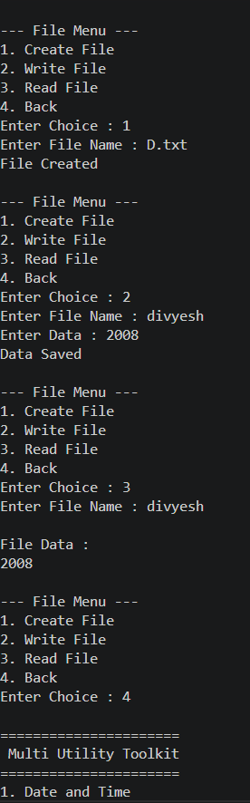
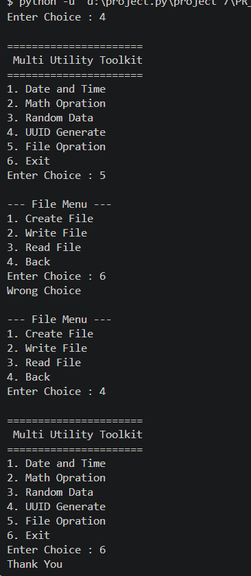

<div align="center">

# 🚀 Multi Utility Toolkit
### *Interactive Python CLI Toolkit for Daily Utilities & Operations*

[](https://www.python.org/)
[](https://www.python.org/)
[](https://www.python.org/)
[](https://www.python.org/)

<br/>

> *"One toolkit, multiple utilities — simplifying everyday Python tasks."*

</div>

---

# 📋 Table of Contents

- [📌 Overview](#-overview)
- [✨ Features](#-features)
- [🏗️ Project Structure](#️-project-structure)
- [🔄 Project Workflow](#-project-workflow)
- [🛠️ Main Program Code](#️-main-program-code)
- [📂 Module Description](#-module-description)
- [▶️ How to Run](#️-how-to-run)
- [📸 Example Output](#-example-output)
- [🛠️ Tech Stack](#️-tech-stack)
- [🏆 Advantages](#-advantages)
- [📄 License](#-license)
- [👤 Author](#-author)

---

# 📌 Overview

The **Multi Utility Toolkit** is a menu-driven Python command-line application that combines multiple useful utilities into a single program.  
It helps users perform common operations such as:

- 📅 Date & Time Utilities
- ➗ Math Operations
- 🎲 Random Data Generation
- 🆔 UUID Generation
- 📁 File Operations

The application uses Python modules and a clean menu-based interface for better code organization and user interaction.

---

# ✨ Features

| Feature | Description |
|---------|-------------|
| 📅 Date & Time | Perform date and time related operations |
| ➗ Math Operations | Execute mathematical calculations |
| 🎲 Random Data | Generate random values and data |
| 🆔 UUID Generator | Create unique UUID values |
| 📁 File Operations | Handle file-related utilities |
| 🔁 Infinite Loop Menu | Program keeps running until Exit |
| 🖥️ CLI Interface | Simple and beginner-friendly console UI |
| 📦 Modular Code | Organized using separate Python modules |

---

# 🏗️ Project Structure

```bash
📦 multi-utility-toolkit/
│
├── 📄 main.py
│
├── 📂 modules/
│   ├── 📄 datetime_module.py
│   ├── 📄 math_module.py
│   ├── 📄 random_module.py
│   ├── 📄 uuid_module.py
│   └── 📄 file_module.py
│
└── 📄 README.md
```

---

# 🔄 Project Workflow

```text
Program Start
      │
      ▼
┌──────────────────────┐
│  Display Main Menu   │
└──────────┬───────────┘
           │
           ▼
 ┌─────────────────────┐
 │ User Selects Choice │
 └──────────┬──────────┘
            │
 ┌──────────┼──────────┐
 ▼          ▼          ▼
Date      Math      Random
Time    Operations    Data
 │          │          │
 ▼          ▼          ▼
UUID     File Ops    Exit
            │
            ▼
     Return to Menu
```

---

# 🛠️ Main Program Code

```python
from modules.datetime_module import datetime_menu
from modules.math_module import math_menu
from modules.random_module import random_menu
from modules.uuid_module import create_uuid
from modules.file_module import file_menu

while True:

    print("\n======================")
    print(" Multi Utility Toolkit ")
    print("======================")

    print("1. Date and Time")
    print("2. Math Opration")
    print("3. Random Data")
    print("4. UUID Generate")
    print("5. File Opration")
    print("6. Exit")

    ch = input("Enter Choice : ")

    match ch:

        case "1":
            datetime_menu()

        case "2":
            math_menu()

        case "3":
            random_menu()

        case "4":
            print("UUID :", create_uuid())

        case "5":
            file_menu()

        case "6":
            print("Thank You")
            break

        case _:
            print("Wrong Choice")
```

---

# 📂 Module Description

| Module | Purpose |
|--------|---------|
| `datetime_module.py` | Handles date and time utilities |
| `math_module.py` | Contains math operations |
| `random_module.py` | Generates random values/data |
| `uuid_module.py` | Creates UUID values |
| `file_module.py` | Performs file operations |

---

# ▶️ How to Run

## Step 1 — Clone Repository

```bash
git clone https://github.com/your-username/multi-utility-toolkit.git
```

---

## Step 2 — Open Project Folder

```bash
cd multi-utility-toolkit
```

---

## Step 3 — Run Program

```bash
python main.py
```

---

# 📸  Output
---


---


---


---


---


---


---

# 🛠️ Tech Stack

| Tool | Purpose |
|------|---------|
| 🐍 Python 3.10+ | Core Programming Language |
| 🖥️ CLI Interface | Console Interaction |
| 📦 Modules | Code Organization |
| 🔁 while Loop | Continuous Program Execution |
| 🔀 match-case | Menu Selection Logic |
| 🧮 Functions | Modular Programming |

---

# 🏆 Advantages

| Advantage | Detail |
|-----------|--------|
| 📦 Modular Design | Easy to maintain and expand |
| 🖥️ Beginner Friendly | Simple console interface |
| ⚡ Lightweight | No external libraries required |
| 🔄 Reusable Modules | Modules can be reused separately |
| 🛠️ Easy to Extend | Add new utilities anytime |
| 📚 Educational | Great practice project for Python learners |

---

# 📄 License

This project is licensed under the **MIT License**.

```text
MIT License — Free to use, modify, and distribute.
```

---

# 👤 Author

<div align="center">

## Divyesh Jadav

> *"Code smart, build useful tools, and keep learning every day."*

**🎓 Role:** Python Developer  
**📍 Location:** India  
**🛠️ Skills:** Python · CLI Applications · Modular Programming · File Handling

</div>

---

<div align="center">

### ⭐ Made with Python & Passion ⭐

</div>
